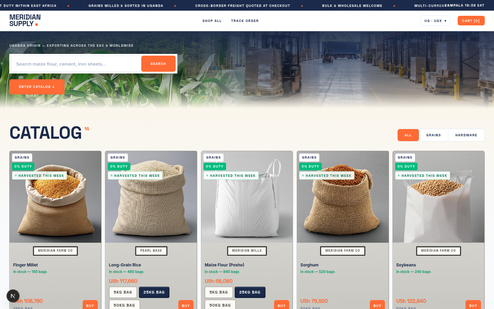
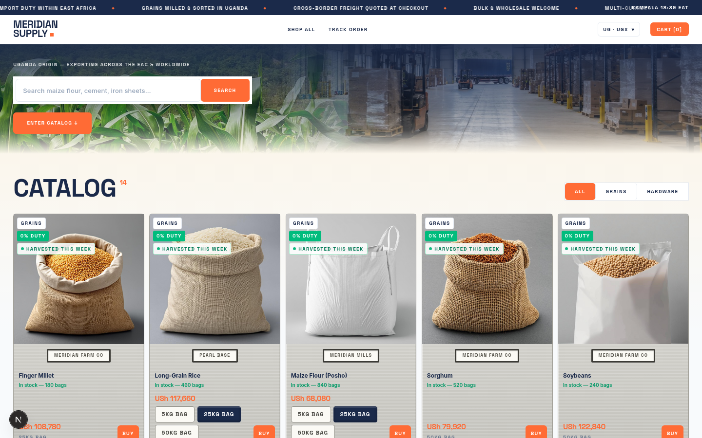
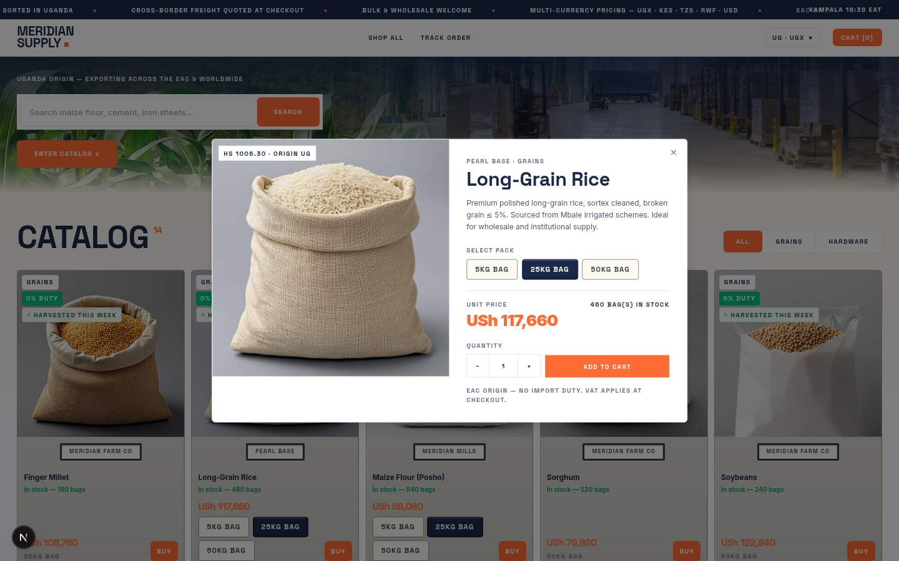
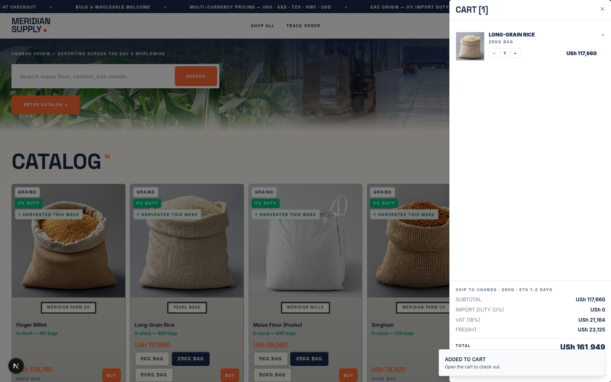
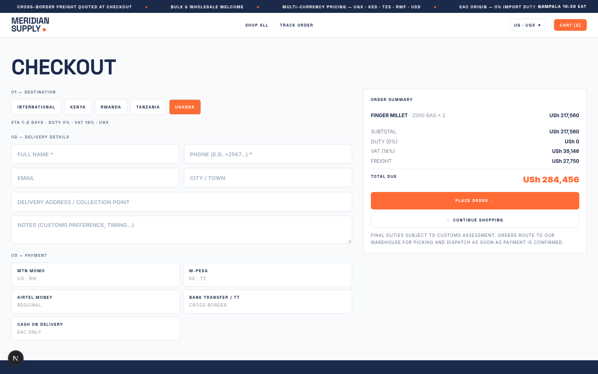

# MERIDIAN SUPPLY CO.

A cross-border e-commerce storefront for a Ugandan exporter of grain and hardware equipment — built to make regional trade feel as solid and physical as the goods being sold.

The catalog tiles read as painted-steel cabinet faces: every tile carries weight-pack switches, live stock and a **BUY** button that opens a spec-sheet dialog where the pack and quantity are chosen before adding to the cart. Behind the storefront sits a region-aware pricing engine that estimates duties, VAT and freight for every East African Community (EAC) destination before checkout.

## Screenshots

| Shop | Catalog |
|---|---|
|  |  |
| *Living-sky hero with live search and EAC ticker* | *Steel tiles with weight-pack switches and BUY* |

| Quick view | Cart |
|---|---|
|  |  |
| *BUY opens the spec sheet: pack selector + quantity stepper* | *Duty, VAT and freight quoted live in the cart* |

| Checkout |
|---|
|  |
| *Destination-aware totals and regional payment methods* |

---

## Features

**Catalog**
- Product grid (2–6 columns, responsive) of painted-steel tiles with weight-pack switches, live stock counts and a BUY button per tile
- Weight-pack switcher on every card (e.g. 25 KG / 50 KG bags) — the tile price updates instantly
- BUY opens the quick-view spec sheet: full product details, pack selection and a quantity stepper before adding to cart
- Live search from the hero section

**Cross-border pricing**
- Region selector in the header (Uganda, Kenya, Tanzania, Rwanda, …)
- Prices convert through stored FX rates and display in the destination currency
- Duties, VAT and per-kg freight are estimated per destination before payment — EAC-origin goods benefit from preferential tariff handling
- Shipping estimates based on shipment base + weight (base + per-kg)

**Commerce**
- Cart drawer with fly-to-cart animation and live badge
- Full checkout flow: customer details → order placement → confirmation
- Order tracking by order number (order events timeline)
- Restock alert signup on out-of-stock products
- Kampala clock and a day-part "living sky" — the light (dawn / golden hour / night) follows real time of day across the whole page, not just the hero

---

## Tech stack

| Layer | Choice |
|---|---|
| Framework | Next.js 16 (App Router, Turbopack) + React 19 + TypeScript |
| Styling | Tailwind CSS 4, shadcn/ui (Radix primitives), custom design system in `globals.css` |
| State | Zustand (cart, region), TanStack Query (catalog fetching) |
| Data | Prisma 6 + SQLite (`db/custom.db`) |
| Validation | Zod |
| Motion | Framer Motion + CSS keyframes |
| Icons | Lucide |

## Getting started

**Prerequisites:** Node.js 20+ (or Bun 1.1+). Bun is used for the scripts below, but `npm`/`pnpm` work the same.

```bash
# 1. install dependencies
bun install

# 2. create/push the database schema (SQLite, zero config)
bun run db:push

# 3. start the dev server
bun run dev
```

Open http://localhost:3000. A seeded database (`db/custom.db`) ships with the repo, so the storefront has products, regions and FX rates out of the box.

### Scripts

| Command | What it does |
|---|---|
| `bun run dev` | Dev server on port 3000 |
| `bun run build` | Production build (standalone output) |
| `bun run start` | Serve the standalone production build |
| `bun run lint` | ESLint |
| `bun run db:push` | Push the Prisma schema to SQLite |
| `bun run db:generate` | Regenerate the Prisma client |
| `bun run db:migrate` | Create/apply a dev migration |
| `bun run db:reset` | Reset the database |

### Environment

`.env` at the project root:

```
DATABASE_URL=file:/home/z/my-project/db/custom.db
```

Adjust the path to point at `db/custom.db` relative to your checkout.

---

## Project structure

```
src/
  app/
    page.tsx              # storefront shell: shop / checkout / confirmation / track views
    layout.tsx            # fonts (Space Grotesk + Inter), global chrome
    globals.css           # design system (steel-tile catalog, motion, labels)
    api/
      products/route.ts   # GET   catalog with variants + stock
      fx/route.ts         # GET   region configs: currency, FX rate, duty, VAT, freight
      orders/route.ts     # GET   track order (by number) · POST place order
  components/storefront/
    header.tsx            # brand, region selector, cart badge, navigation
    hero.tsx              # living-sky hero with search
    product-grid.tsx      # steel tiles, weight-pack toggles, BUY -> quick view
    quick-view.tsx        # spec sheet dialog: pack selector + quantity stepper
    cart-drawer.tsx       # cart panel
    checkout.tsx          # customer + delivery details, price breakdown
    confirmation.tsx      # order confirmation
    track-order.tsx       # order tracking by number
    fly-dot.tsx           # fly-to-cart dot animation
    kampala-clock.tsx     # live Kampala time
    footer.tsx
  components/ui/          # shadcn/ui primitives
  lib/                    # store (zustand), types, pricing helpers
prisma/schema.prisma      # data model
public/products/          # product imagery
kwanza-erp-src/           # reference: the merchant-side ERP the storefront feeds into
scripts/                  # seeding + image tooling
```

## Data model (Prisma)

| Model | Purpose |
|---|---|
| `Product` | Catalog item: label, category, unit, pricing, stock, HS code, origin country, JSON variants (weight packs) |
| `Customer` | Checkout customers |
| `OrderProcessing` | Placed orders: destination region, totals, status |
| `OrderLineItem` | Per-product order lines (pack, qty, unit price) |
| `OrderEvent` | Order timeline events used by tracking |
| `RegionConfig` | Per-destination trade config: currency, FX rate, duty rate, VAT rate, freight base + per-kg, ETA, EAC flag |

## API

| Method | Endpoint | Description |
|---|---|---|
| GET | `/api/products` | Catalog with variants and stock |
| GET | `/api/fx` | Region configs (currency, rates, duties, VAT, freight) |
| GET | `/api/orders` | Track an order by number |
| POST | `/api/orders` | Place an order (creates customer, order, lines, first event) |

## Design system

- **Palette:** navy ink `#1B2A4A`, brand orange `#E8622C`, paper white, hairline greys
- **Type:** Space Grotesk (display) + Inter (body), uppercase letterspaced labels
- **Interaction contract:** hardware-feel feedback — a cursor spotlight sheen drifts across the steel tiles, every button depresses on press, and adding flies a dot into the cart badge. All depth is drawn with inset shadows; nothing floats; motion respects `prefers-reduced-motion`.

## Deployment

The production build outputs a standalone Node server (`.next/standalone/server.js`).

### VPS (recommended)

SQLite keeps ops simple — run it on any VPS with Node 20+ or Bun:

```bash
bun install
bun run db:push
bun run build
bun run start          # serves on :3000
```

Keep the process alive with systemd:

```ini
[Service]
WorkingDirectory=/srv/meridian
ExecStart=/usr/local/bin/bun .next/standalone/server.js
Restart=always
User=www-data
Environment=NODE_ENV=production
Environment=DATABASE_URL=file:/srv/meridian/db/custom.db

[Install]
WantedBy=multi-user.target
```

Then reverse-proxy :3000 behind Nginx or Caddy for TLS. **Persist `db/custom.db`** (and `public/products/`) across deploys — it holds the catalog, orders and region config.

### Vercel / serverless

The app deploys, but serverless filesystems are ephemeral — a SQLite file won't survive. Before shipping there, swap the Prisma datasource to a hosted database (e.g. Postgres on Neon/Supabase, or Turso for a SQLite-compatible edge DB): change the `provider` in `prisma/schema.prisma`, update `DATABASE_URL`, and re-run `db:push`.

## Contributing

1. Fork and create a feature branch (`feat/your-change`).
2. `bun install && bun run db:push && bun run dev`.
3. Keep visual work consistent with the design system (see above): navy ink / brand orange, uppercase letterspaced labels, and the hardware interaction contract — all depth is drawn with inset shadows, nothing floats, and motion must respect `prefers-reduced-motion`.
4. Run `bun run lint` before opening your PR and keep commits small and descriptive.

## Notes

- Orders, stock levels and tracking events are demo data intended for demonstration and further development — wire them to a payment provider and fulfillment pipeline before production use.
- `kwanza-erp-src/` is included as reference material for the merchant-side ERP (warehouse, order processing, cash-on-delivery reconciliation) that this storefront is designed to feed into.
